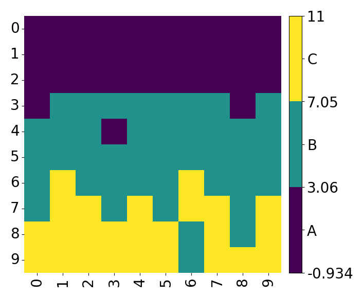

<script src="//cdn.jsdelivr.net/npm/prismjs@1/components/prism-python.min.js"></script>
# Common Function

## 简介
Common Function 是一个绘图的通用函数库，用于便利地绘制 heatmap 等图表同时可以简单地自定义图像设计。 CF 解决了直接使用 matplotlib 绘制图表时繁杂的底层代码设计和 seaborn 过于定式化的问题，方便使用者可以自由地设计图表中的各种元素。通过 Gallery 部分使用者可以方便地查询到各种元素加入方案。

## 快速上手

我们从绘制一个简单的 heatmap 开始。首先设置图片的留白部分，创建 fig 与 axis 对象：
    
```python
import common_functions as cf
import numpy as np
import pandas as pd
import matplotlib.pyplot as plt
# 设置图片的留白部分
margin = {'left': 0.1, 'right': 0.7, 'top': 0.9, 'bottom': 0.1}
# 创建 plt 的 画布和坐标轴对象
fig, ax = cf.get_fig_ax(1, 1, margin=margin)
```

然后我们生成一个随机的数据集

```python
data = np.zeros((10, 10))
for i in range(10):
    for j in range(10):
        data[i, j] = i + np.random.randn()
```
并绘制 heatmap：
    
```python
cf.sns_heatmap(ax, pd.DataFrame(data), square=True, cmap=plt.cm.viridis, discrete=True,discrete_num=3, discrete_label=['a', 'b', 'c'])
```
<div  align="center">    

</div>
